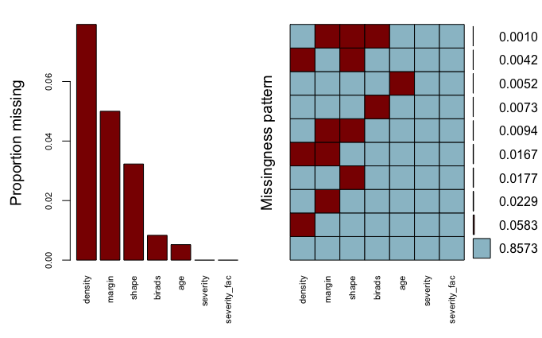
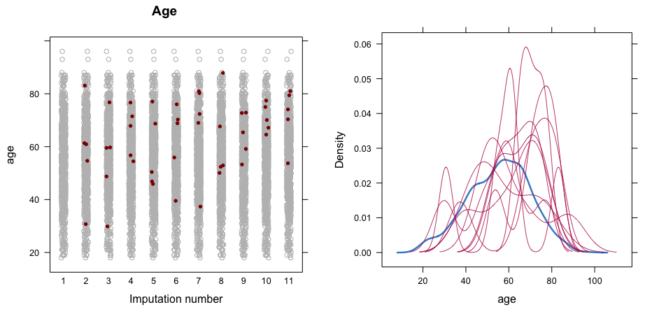
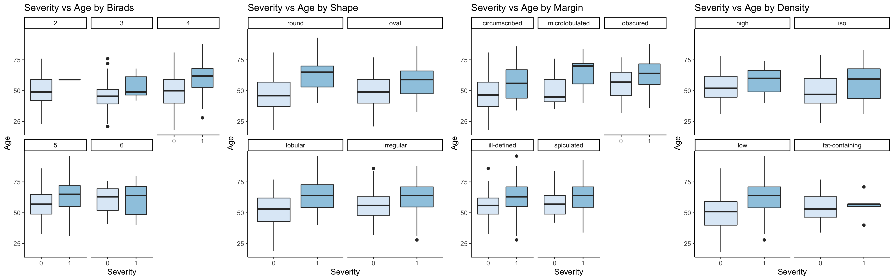

---
output:
  pdf_document: default
  html_document: default
---

```{r setup, include=FALSE}
# DO NOT ALTER CODE IN THIS CHUNK
# The very first time you use this R markdown file, you should install each of the packages below.
# The same goes for other packages you might decide to use
# Remember that you only need to install each R package once in R (ever -- unless you change computers).
# All you need to do whenever you need to use the package again (after restarting the R session),
# is to use the library function to call the package.
# For example, type install.packages("knitr") in the console to install the knitr package. 
knitr::opts_chunk$set(echo = TRUE)

library(dplyr)
library(ggplot2)
library(GGally)
library(knitr)
library(xtable)
library(rms)
library(arm)
library(pROC)
library(e1071)
library(caret)
library(gridExtra)
```

## 1. Summary

Depending on the severity, cancer or tumors can often be classified as either benign or malignant. This analysis aims to determine the effects that several factors, including a breast lesion's physical attributes have on a lesion's severity. I am also interested in assessing which factor has the strongest association with malignancy. The statistical methods utilized in our analysis includes but does not limit to: multiple imputation of missing values, exploratory data analysis (EDA), fitting of a logistic regression model and model assessment. My final findings suggest that there are significant relationships between the odds of developing a malignant breast lesion and BI-RADS score, its mass shape and mass margin, as well as patient age, which has the strongest association with malignancy.  

## 2. Introduction

Despite its low mortality rate, breast cancer is the most commonly diagnosed cancer in women in the United States. The most effective method for screening breast cancer is mammography, which involves taking an x-ray image of the breast. If further assessment is required on a suspicious lesion, breast biopsy would also be introduced but it is often an unpleasant process. Therefore, there has been a high demand in utilizing machine learning on mammography data to assist diagnosis. As previously mentioned, I attempt to investigate this possibility by exploring the relationships between lesion malignancy and common measurements such as patient age, mass shape and margin.  am particularly interested in the assumption that certain mass shape is expected to increase the odds of malignancy. In addition, I am also interested in quantifying the effect of mass density. These questions could be addressed by fitting and interpreting a logistic regression model. Last but not the least, I hope to identify most indicative predictor at determining the odds of a malignant lesion, which could be determined through the point estimates of predictor effects.

## 3. Data

The data I have used for this analysis came from a study conducted by Matthias Elter, R. Schulz-Wendtland and T. Wittenberg in 2007. And they have generously shared the original dataset with the UCI MAchine Learning Repository. This dataset consists of 961 observations and 6 attributes (1 response and 5 predictors). There are 445 positive cases and 516 negative cases, which is pretty balanced for a classification problem. The attribute detail is summarized below:

* *BI-RADS*: BI-RADS assessment ranging from 1 (definitely benign) to 6 (biopsy proven malignancy);

* *Age*: patient age;

* *Shape*: lesion mass shape, includes round, oval, lobular and irregular;

* *Margin*: lesion mass margin, includes circumscribed, microlobulated, obscured, ill-defined and spiculated;

* *Density*: lesion mass density, includes high, iso, low and fat-containing;

* *Severity*: the response predictor that represents lesion severity, can be either benign or malignant.

Based on the description above, each predictor is then cleaned by first converting them to the appropriate. This dataset also contains some missing values, which needs to be imputed through statistical approach. 

### 3.1 Imputation

In data analysis, there are often different ways to deal with missing values. If the data are missing completely at random and are contributing to just small portion of the entire dataset, one could reasonably discard these observations. However, missing completely at random is rarely plausible in practice and it's generally better to keep all observations. Therefore, a statistical imputation method is more desirable and I start off by visualizing these missing columns.

{height=20%}

Figure 1. indicates that there are missing values in all predictor variables. To address this problem, I'm applying Multiple Imputation to generate 10 imputed copies of the original data. This is done to better estimate the uncertainty so both the within and between data variance could be taken into consideration. In addition, it's more flexible in modeling missing data based on their types. Concretely, it allows me to use Bayesian Linear Regression on continuous predictors, Logistic Regression on binary variables, Multinominal Logistic Regression on nominal categorical variables and Proportional Odds Model on ordinal categorical variables. Note that Bayesian Linear Regression is used instead of Predictive Mean Matching for continuous variable because I don't want the imputed values to take on existing values nor be bound by their ranges. After imputation, I use strip plot and density plot on continuous predictors to assess the imputation quality. In this case, patient age is the only continuous predictor, as illustrated below:

{height=20%}

A good imputation would mean that there are no interesting differences in distribution between observed and imputed data. In the strip plot, imputed values look pretty evenly distributed across all 10 copies of the original dataset. On top of that, all imputed values are within the range of the original non-missing values. In the density plot, distribution of observed values is unimodal. And distribution of imputed values from each copy generally only has 1 peak. Note that even though some density plots appear to be multi-modal, the valleys in these curves could come from the fact that there are only 5 missing values to be imputed. This sparsity makes it hard to construct a smooth unimodal curve when when the imputed values span a wide range. In conclusion, I am going to stick with the outcome of Multiple Imputation.
 
### 3.2 EDA

EDA is performed on just 1 of the 10 copies. I start EDA by visually inspecting the relationship that each predictor variable has with the response variable, which is lesion severity. Since lesion severity is binary, I will use box plots for continuous variables and contingency tables for categorical variables. 

For patient age, there is a disparity in median and distribution between 2 severity levels. This suggests that patient age is a predictor that should be controlled for during model construction. On the other hand, the ratios of severity levels vary across different predictor levels for all categorical predictors, except for lesion density. Therefore, I will have to determine if BI-RADS score, lesion shape and lesion margin are statistically significant, and consider including them in the final model.

Following that, I explore the interaction between different predictors. I start off by looking at the interactions between patient age and other categorical predictors. As illustrated in the figure below, the trends are generally consistent across all levels and do not exhibit an interactions:

{height=25%}

To check if the interactions between the categorical predictors are meaningful, I inspect contingency tables first to check that there are enough samples in the combinations of various predictor levels. However, all tables include certain combinations where the sample size is 0. For instance, the contingency table for lesion density and BI-RADS is shown below, where there are no observations where the lesion density is high while the BI-RADS score is 6:

\begin{table}[ht]
\centering
\begin{tabular}{rrrrrr}
  \hline
 & 2 & 3 & 4 & 5 & 6 \\ 
  \hline
high &   1 &   1 &  11 &   6 &   0 \\ 
  iso &   4 &   2 &  50 &  15 &   1 \\ 
  low &   8 &  32 & 485 & 323 &   9 \\ 
  fat-containing &   1 &   1 &   3 &   6 &   1 \\ 
   \hline
\end{tabular}
\end{table}

Therefore, there are no needs to explore the interactions between categorical variables. And as a summary, I will include all main effects in further analysis and use the output of the model selection process to verify the findings from EDA.


## 4. Model

Following the conclusion from the previous section, there are multiple steps involved in defining my final model:

1. Using the same copy of dataset used for EDA, I first construct a naive logistic model using the all the main effects I deemed to keep in the previous section. Note that no interactions terms are included based on observations suggested by EDA. The model summary suggests that all predictors are statistically significant except for lesion density, which aligns with what I have seen in EDA. This could be that the linear relationship between lesion density and the log odds of lesion severity is not strong enough to be detected by this sample. Using the 'best' threshold value which is 0.399, this naive model achieves a sensitivity: 0.828, a specificity: 0.869 and an AUC of 0.913.

2. To assess model, I check binned residual plots to make sure most of the points are within the 95% CI and do not exhibit any patterns. Based on the binned residual plots, there are only 2 points outside of the CI band in the predicted possibilities vs. residual plots, and 2 points outside of the CI band in the patient age vs. residual plot. Therefore, the naive model seems to satisfy the linearity and independence assumptions reasonably well.

3. The next part of model selection requires fitting a null model, which only captures the two predictors that I care about - lesion shape and lesion density, as well as a full model, which is the naive model that I previously built. (Note that if any predictors that were previously determined to be statistically significant are removed through the model selection process, I will then perform F-test on these predictors to evaluate their significance). Here I attempt to do model selection through forward, step-wise and backward selections. As for the selection criterion, I decide to use AIC. R-squared is not used here because the objective is not prediction. BIC is not used because it penalizes models with extra predictors. In this application where I try to determine potential factors that could impact lesion severity, I would prefer False Positives than False Negatives. For the result, forward selection returns all 5 original predictors; both step-wise and backward selection gives patient age, BI-RADS scores, lesion shape and lesion margin. 

4. To decide which one to keep, I perform F-test between the two outputs to explore if the extra predictor (lesion density) is significant. The returned p-value of F-test is 0.2133, which is greater than 0.1. Thus we fail to reject the null hypothesis, and will keep the result of step-wise and backward selections.

5. I then repeat Step 2 to assess the new model. Using the binned residual plots, there are 3 points and 2 points outside of the 95% CI band in the predicted possibilities plot and patient age vs. residual plot, respectively. This again confirms that the linearity and independence assumptions are fulfilled. Using the 'best' threshold value which is 0.409, the new model achieves a sensitivity: 0.831, a specificity: 0.865 and an AUC of 0.911. This performance is pretty close to that of the naive model. 

6. To ensure that my findings are general enough to be applied to the original dataset, another imputed copy is selected to undergo the same procedure: In model selection, F-test is utilized on the same models to check whether lesion density is a significant predictor. The test returns a p-value of 0.632 and thus rejects the null hypothesis where lesion density is insignificant. This aligns with the result obtained from the first copy. Moving on, binned residual plots are generated to perform model assessment. Similar plots are returned, where the number of points outside the 95% CI band are negligible. This indicates that the linearity and independence assumptions are met. Last but not the least, I check for model performance. sing the 'best' threshold value which is 0.333, the new model achieves a sensitivity: 0.800, a specificity: 0.885 and an AUC of 0.910. These numbers are really close to what I have previously obtained. In general, there are no obvious deviation from what I found previously. Therefore, the model does a reasonably good job at capturing the linear relationship and effects between the selected predictors and the log odds of lesion severity. This model is depicted in the formula below, where $\pi_i$ is the probability of a lesion being malignant for observation $i$, and $x_{1i}$ to $x_{4i}$ are the vectors containing the corresponding values for patient age, BI-RADS scores, lesion shape and lesion margin.

$$
\log(\frac{\pi_i}{1 - \pi_i}) = \beta_0 + \beta_1 x_{1i} + \beta_2 x_{2i} + \beta_3 x_{3i}+ \beta_4 x_{4i};
$$

7. In the last step, I apply the formula above to all 10 copies of imputed data based on the Rubin combining rules. Model summary is shown in the table below.

\begin{table}[ht]
\centering
\begin{tabular}{rlrrrrr}
  \hline
 & term & estimate & std.error & statistic & df & p.value \\ 
  \hline
1 & (Intercept) & -5.67 & 1.18 & -4.82 & 921.42 & <0.001 \\ 
  2 & shapeoval & -0.27 & 0.32 & -0.85 & 833.55 & 0.40 \\ 
  3 & shapelobular & 0.29 & 0.40 & 0.74 & 648.05 & 0.46 \\ 
  4 & shapeirregular & 1.09 & 0.36 & 3.06 & 506.00 & <0.001 \\ 
  5 & birads3 & 0.86 & 1.20 & 0.72 & 913.26 & 0.47 \\ 
  6 & birads4 & 1.17 & 1.09 & 1.07 & 896.97 & 0.29 \\ 
  7 & birads5 & 3.43 & 1.11 & 3.10 & 891.69 & <0.001 \\ 
  8 & birads6 & 2.99 & 1.35 & 2.21 & 823.44 & 0.03 \\ 
  9 & age & 0.05 & 0.01 & 5.64 & 935.24 & <0.001 \\ 
  10 & marginmicrolobulated & 0.93 & 0.60 & 1.55 & 916.63 & 0.12 \\ 
  11 & marginobscured & 0.56 & 0.38 & 1.46 & 551.83 & 0.14 \\ 
  12 & marginill-defined & 0.88 & 0.33 & 2.68 & 370.75 & <0.01 \\ 
  13 & marginspiculated & 1.08 & 0.41 & 2.65 & 479.14 & <0.01 \\ 
   \hline
\end{tabular}
\end{table}


## 5. Conclusion

In this section, I attempt to interpret the model and answer the questions I previously asked. The result shows that all  predictors that certain levels that are statistically significant at level 0.01. What this means is that there could be a significant association between each of these predictors and lesion severity. And this strong association could be used to better diagnose and put more confidence in the diagnosis of breast cancer. 

This model’s baseline is a patient who is '0' years old with a BI-RADS score of 2, whose lesion has a round shape and circumscribed margin. For a patient of this particular condition, I expect the odds of the lesion mass being malignant to be 0.0034, which is really low. 

According to my model, patient age could be a significant predictor. More specifically, a year increase in patient age is expected to increase the odds of malignancy by 5.1%, while holding all other predictors constant. Besides patient age, a BI-RADS rating of 5 is expected to increase the odds of malignancy by 2987.66% compared to a BI-RADS rating of 2, and a BI-RADS rating of 6 is expected to increase the odds of malignancy by 1888.57% compared to a BI-RADS rating of 2, while holding the other variables constant. This also makes a lot of sense since high BI-RADS is used clinically to assess lesion severity, and a high value is often suggestive of malignancy. 

Furthermore, the following conclusions could also be made using physical attributes of a lesion mass: a lesion mass with an irregular shape is expected to increase the odds of malignancy by 197.43% compared to a round lesion, while holding the other variables constant. Additionally, while holding the other predictors constant, a lesion mass with an ill-defined margin or a spiculated margin is expected to increase the odds of malignancy by 141.09% and 194.47%, respectively, when compared to a lesion mass with a circumscribed margin. 

Going back to the original questions I asked, I know that odds of malignancy are generally higher in lesions with irregular shape. In addition, lesion margin could also be a significant predictor in indicating malignancy. Surprisingly, there are no strong evidence to suggest that the density of a lesion mass would affect its severity. Mathematically, it means that the null hypothesis where the coefficient of lesion density is equal to 0, cannot be rejected. Last but not the least, the most indicative predictor at determining the odds of malignancy is the BI-RADS rating. More specifically, having a BI-RADS rating of 5 and 6 is very suggestive of having a malignant mass. However, this predictor somewhat subjective since it is an assessment score given by a physician and reflects the physician opinion on the condition. Meanwhile, this information is also very redundant because it conveys the exact same message as the response variable. Therefore, I believe the lesion shape is the most critical predictor, if only lesion related physical attributes are taken into consideration.

On thing to keep in mind is that statistical significance or having a strong association does not mean causation. Therefore, it is incorrect to make statements such as: a lesion mass with an irregular shape will cause a malignant cancer, or a lesion mass with an ill-defined margin can lead to malignancy. The model in intended to aid phycians with their decision making instead of replacing them. For example, if the model yields a diagnosis that is different from what the clinician concludes, then it is worth further investigation. Additionally, the model is built solely based on the provided data. Therefore, all interpretations made pertain to this dataset only. It might not be appropriate to apply this model to other population without taking addtional data or attributes into consideration.

There are several limitations to this analysis:

* Like I mentioned previously, this model might not be applicable to other population due to limited observations and attributes. Since development of breast cancer could also depend on other biometric data such as race, weight, parity. A better analysis would take these factors into consideration.

* Since output of mammograph are images, a better approach would leverage the power of image processing and Convolutional Neural Network to analyze all these image data. The advantage is that this metholodogy could preserve data integrity and also capture nonlinear relationships that could be predicative of lesion severity. 


